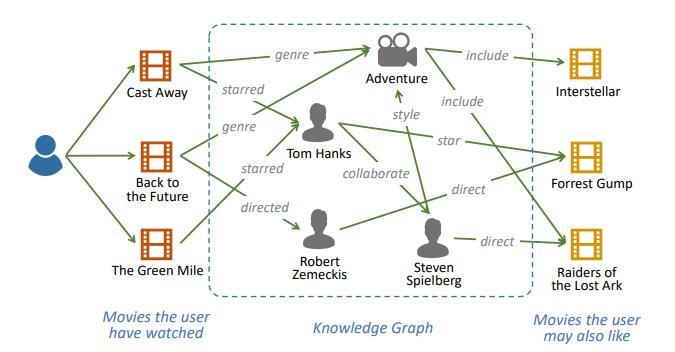
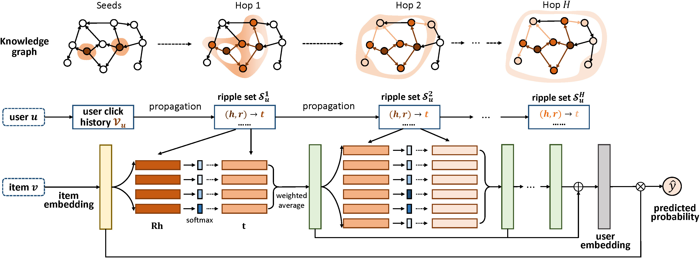

# Recommendation System on RippleNet&Movielens

## This repository is a Recommendation system based on RippleNet and Movielens-1M:


The recommendation system will predict the movies that the user may also like from the movies that the user have watched through the auxiliary information of the knowledge graph.

---


#### For the model and paper on [arxiv](https://arxiv.org/abs/1803.03467):

> RippleNet: Propagating User Preferences on the Knowledge Graph for Recommender Systems  
> Hongwei Wang, Fuzheng Zhang, Jialin Wang, Miao Zhao, Wenjie Li, Xing Xie, Minyi Guo  
>The 27th ACM International Conference on Information and Knowledge Management (CIKM 2018)

For the authors' official TensorFlow implementation, see [hwwang55/RippleNet](https://github.com/hwwang55/RippleNet).



RippleNet is a deep end-to-end model that naturally incorporates the knowledge graph into recommender systems.
Ripple Network overcomes the limitations of existing embedding-based and path-based KG-aware recommendation methods by introducing preference propagation, which automatically propagates users' potential preferences and explores their hierarchical interests in the KG.


---


#### For the dataset called movielens-1m on [grouplens](https://grouplens.org/datasets/movielens/1m/):

The GroupLens Research Project is a research group in the Department of Computer Science and Engineering at the University of Minnesota. Members of the GroupLens Research Project are involved in many research projects related to the fields of information filtering, collaborative filtering, and recommender systems. The project is lead by professors John Riedl and Joseph Konstan. The project began to explore automated collaborative filtering in 1992, but is most well known for its world wide trial of an automated collaborative filtering system for Usenet news in 1996. Since then the project has expanded its scope to research overall information filtering solutions, integrating in content-based methods as well as improving current collaborative filtering technology.

> MovieLens 1M movie ratings.
>
> Stable benchmark dataset.
>
> 1 million ratings from 6000 users on 4000 movies. 
>
> Released 2/2003.

##### All ratings are contained in the file "ratings.dat" and are in the following format:

UserID::MovieID::Rating::Timestamp

- UserIDs range between 1 and 6040 
- MovieIDs range between 1 and 3952
- Ratings are made on a 5-star scale (whole-star ratings only)
- Timestamp is represented in seconds since the epoch as returned by time(2)
- Each user has at least 20 ratings

##### User information is in the file "users.dat" and is in the following format:

UserID::Gender::Age::Occupation::Zip-code

All demographic information is provided voluntarily by the users and is
not checked for accuracy.  Only users who have provided some demographic
information are included in this data set.

- Gender is denoted by a "M" for male and "F" for female
- Age is chosen from the following ranges:

  *  1:  "Under 18"
  *  18:  "18-24"
  *  25:  "25-34"
  *  35:  "35-44"
  *  45:  "45-49"
  *  50:  "50-55"
  *  56:  "56+"
- Occupation is chosen from the following choices:

  *  0:  "other" or not specified
  *  1:  "academic/educator"
  *  2:  "artist"
  *  3:  "clerical/admin"
  *  4:  "college/grad student"
  *  5:  "customer service"
  *  6:  "doctor/health care"
  *  7:  "executive/managerial"
  *  8:  "farmer"
  *  9:  "homemaker"
  *  10:  "K-12 student"
  *  11:  "lawyer"
  *  12:  "programmer"
  *  13:  "retired"
  *  14:  "sales/marketing"
  *  15:  "scientist"
  *  16:  "self-employed"
  *  17:  "technician/engineer"
  *  18:  "tradesman/craftsman"
  *  19:  "unemployed"
  *  20:  "writer"

##### Movie information is in the file "movies.dat" and is in the following format:

MovieID::Title::Genres

- Titles are identical to titles provided by the IMDB (including
  year of release)
- Genres are pipe-separated and are selected from the following genres:

  * Action
  * Adventure
  * Animation
  * Children's
  * Comedy
  * Crime
  * Documentary
  * Drama
  * Fantasy
  * Film-Noir
  * Horror
  * Musical
  * Mystery
  * Romance
  * Sci-Fi
  * Thriller
  * War
  * Western

- Some MovieIDs do not correspond to a movie due to accidental duplicate
  entries and/or test entries
- Movies are mostly entered by hand, so errors and inconsistencies may exist


---


## Files in the folder

- `data/`
  - `movie/`
    - `item_index2entity_id.txt`: the mapping from item indices in the raw rating file to entity IDs in the KG;
    - `kg_part1_rehashed.txt` and `kg_part2_rehashed.txt`: knowledge graph file;
    - `movies.dat`: raw movies file of MovieLens-1M;
    - `ratrings.dat`: raw rating file of MovieLens-1M;
    - `users.dat`: raw user file of MovieLens-1M;
    - `OTHERS`: all the files saved while preprocessing,training and using;
  - `model/`
    - `ripplenet.pt`: model trained and saved;
- `src/`
  - `data_loader.py`: load data from the file preprocessed;
  - `model.py`: model itself;
  - `train.py`: train;
  - `predict.py`: predict.py;
  - `main.py`: train by deploying `train.py`;
  - `use.py`: use by deploying `predict.py`;
  - `demo.py`: use in demo system also by deploying `predict.py`.


---


## Required packages
The code has been tested running under Python 3.8, with the following packages installed (along with their dependencies):
- pytorch >= 1.10.0
- numpy >= 1.21.0
- sklearn >= 1.0.0
- pyqt5 >= 5.15.0


---


## Running the code
```shell
$ cd src
$ python preprocess.py
$ python main.py
$ python use.py
$ python demo.py
```
>If you will use the recommended system in the console, execute `$ Python use py`; 
>
>If you will use it in a demo system based on PyQt5, execute `$ Python demo py`.


---
## Link
>**https://github.com/Andempathy/Recommendation-system-based-on-ripplenet**